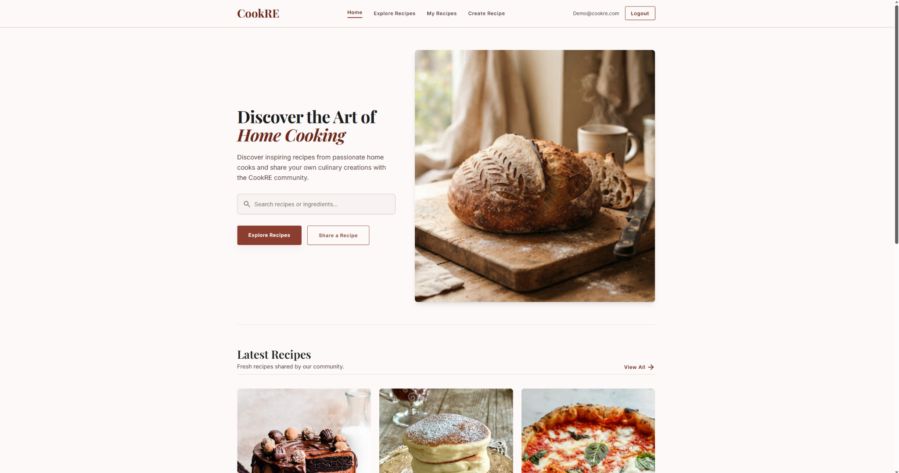
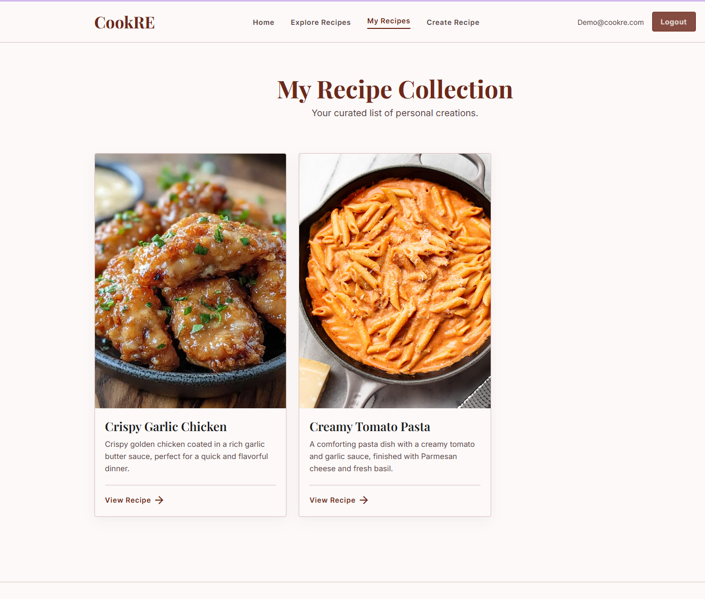
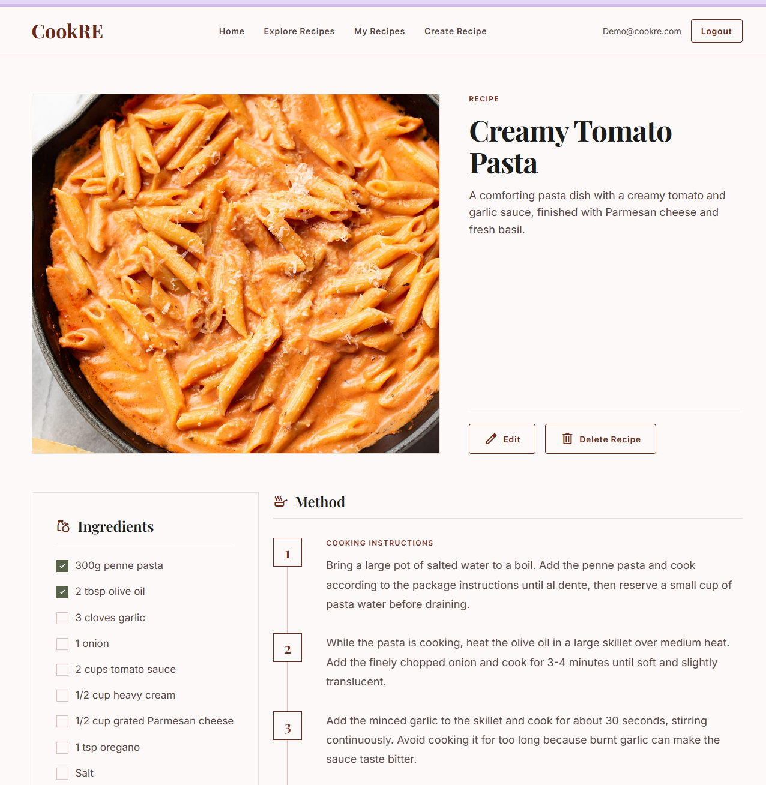
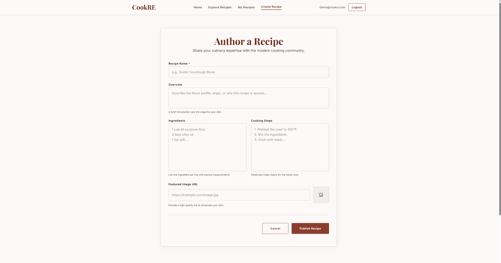
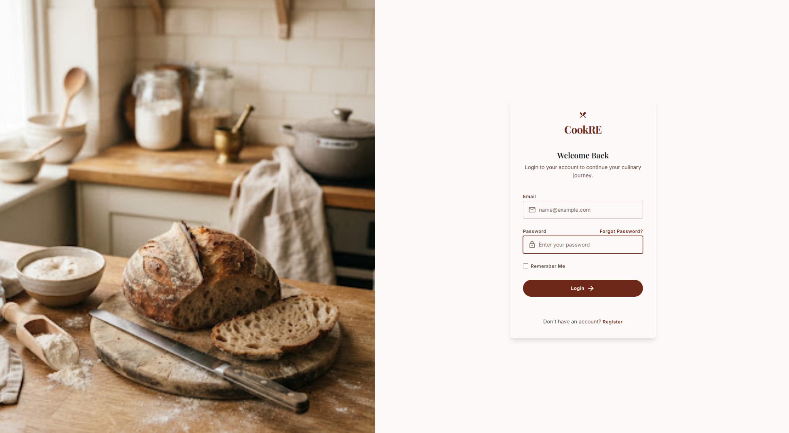
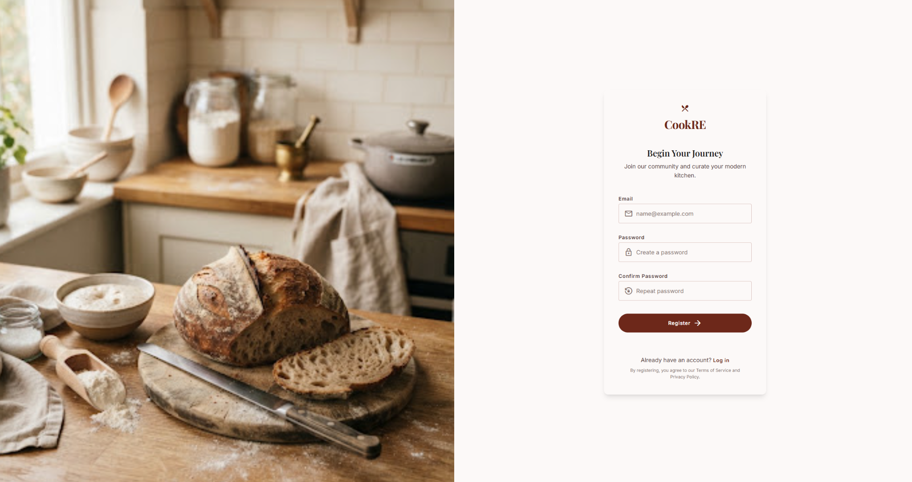

# 🍳 CookRE

CookRE is a full-stack recipe sharing web application built with **ASP.NET Core MVC**.

The application allows users to discover recipes, create and manage their own recipes, and securely access personalized features through ASP.NET Core Identity.

The project was built to practice full-stack web development with a strong focus on **MVC architecture, database operations, authentication, authorization, and user-owned resources**.

---

## 📸 Preview



---

## ✨ Features

- 🔐 User registration and login
- 🚪 Secure logout
- 🍽️ Browse recipes
- 🔎 Search recipes
- 📖 View full recipe details
- ➕ Create new recipes
- ✏️ Edit your own recipes
- 🗑️ Delete your own recipes
- ❤️ View recipes created by the logged-in user
- 👤 Recipe ownership and authorization
- 🖼️ Recipe images using image URLs
- 📱 Responsive user interface
- ⚠️ Custom access denied page
- 🎨 Custom Tailwind CSS design

---

## 🛠️ Tech Stack

### Backend

- C#
- ASP.NET Core MVC
- Entity Framework Core
- ASP.NET Core Identity
- LINQ

### Frontend

- Razor Views
- Tailwind CSS
- HTML
- JavaScript
- Material Symbols

### Database

- SQL Server

### Tools

- Visual Studio
- Git
- GitHub
- npm / Tailwind CLI

---

## 🔐 Authentication & Authorization

CookRE uses **ASP.NET Core Identity** for authentication.

Users can register, log in, and log out securely.

Recipe ownership is also enforced so that authenticated users can manage only the recipes they created.

For example:

- Guests can browse recipes.
- Authenticated users can create recipes.
- Owners can edit their own recipes.
- Owners can delete their own recipes.
- Users cannot modify recipes belonging to another account.

---

## 🖼️ Screenshots

### Explore Recipes

Browse and search through recipes shared on CookRE.


---

### My Recipes

Authenticated users can view and manage the recipes they have created.



---

### Recipe Details

Each recipe has a dedicated page displaying its overview, ingredients, cooking steps, and image.



---

### Create Recipe

Authenticated users can publish new recipes through the recipe creation form.



---

### Login

CookRE includes a custom-designed authentication interface built on top of ASP.NET Core Identity.



---

### Register

New users can create an account and start sharing their own recipes.



---

## 🏗️ Project Structure

CookRE follows the **Model-View-Controller (MVC)** architecture.

```text
CookRE/
│
├── Areas/
│   └── Identity/
│
├── Controllers/
│
├── Data/
│
├── Models/
│
├── Views/
│   ├── Home/
│   ├── Recipes/
│   └── Shared/
│
├── wwwroot/
│   ├── css/
│   └── images/
│
└── Styles/
```

### Models

Represent the application's data and database entities.

### Views

Razor views responsible for rendering the user interface.

### Controllers

Handle requests, application flow, database operations, and communication between models and views.

### Identity

Handles user authentication and account-related functionality.

---

## 🚀 Getting Started

### Prerequisites

Make sure you have installed:

- .NET SDK
- SQL Server
- Visual Studio or another .NET-compatible IDE
- Node.js

### 1. Clone the repository

```bash
git clone https://github.com/mohimeen/CookRE.git
```

### 2. Navigate to the project

```bash
cd CookRE
```

### 3. Restore .NET dependencies

```bash
dotnet restore
```

### 4. Install frontend dependencies

```bash
npm install
```

### 5. Configure the database

Update the database connection string in your local configuration as needed.

Then apply the Entity Framework migrations:

```bash
dotnet ef database update
```

### 6. Build Tailwind CSS

```bash
npx @tailwindcss/cli -i ./CookRE/Styles/Input.css -o ./CookRE/wwwroot/css/tailwind.css
```

For development with automatic CSS rebuilding:

```bash
npx @tailwindcss/cli -i ./CookRE/Styles/Input.css -o ./CookRE/wwwroot/css/tailwind.css --watch
```

### 7. Run the application

```bash
dotnet run --project CookRE
```

Then open the local URL displayed in the terminal.

---

## 🧠 What I Learned

Building CookRE helped me practice and understand:

- ASP.NET Core MVC architecture
- Routing and controller actions
- Razor Views and Tag Helpers
- CRUD operations
- Entity Framework Core
- LINQ queries
- Database migrations
- ASP.NET Core Identity
- Authentication and authorization
- User-owned database records
- Model validation
- Responsive UI development with Tailwind CSS
- Git branching and feature-based development
- Git merge workflows and version control

---

## 🔮 Future Improvements

Possible improvements for future versions include:

- Real image uploads instead of image URLs
- Recipe pagination / load more
- Recipe categories
- Cooking time and difficulty
- Improved filtering and sorting
- User profiles
- Favorites
- Recipe ratings and reviews

---

## 👨‍💻 Author

Developed by **Mohimen** as a full-stack ASP.NET Core MVC portfolio project.
